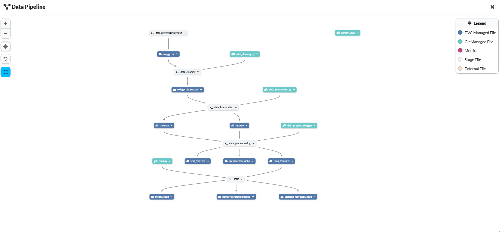
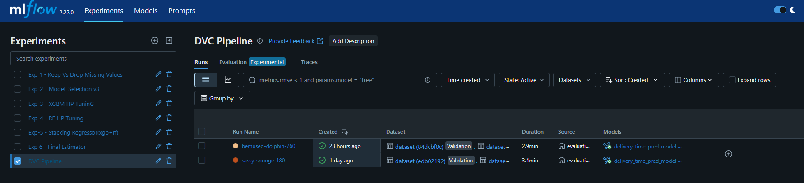
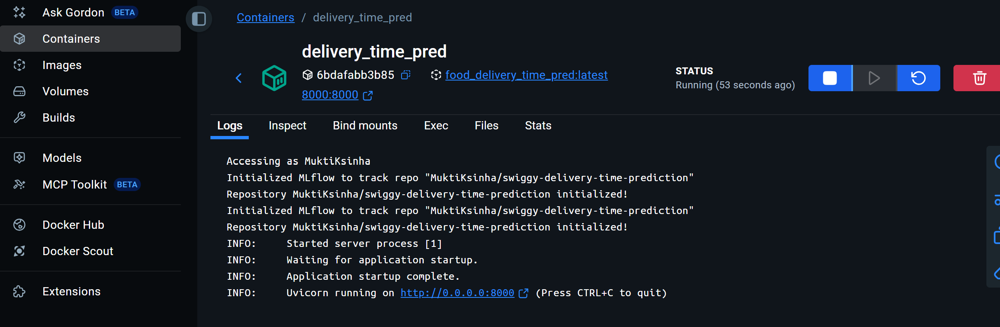
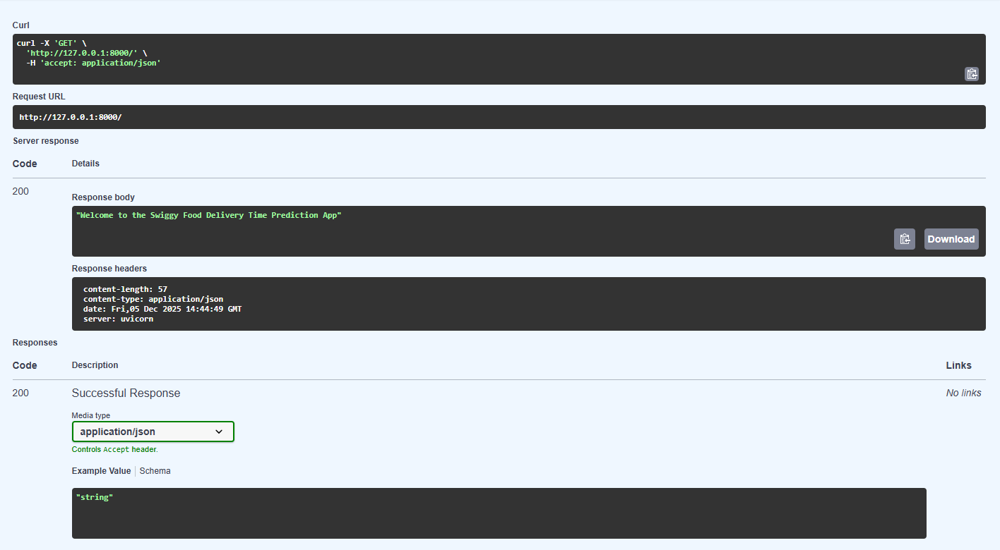
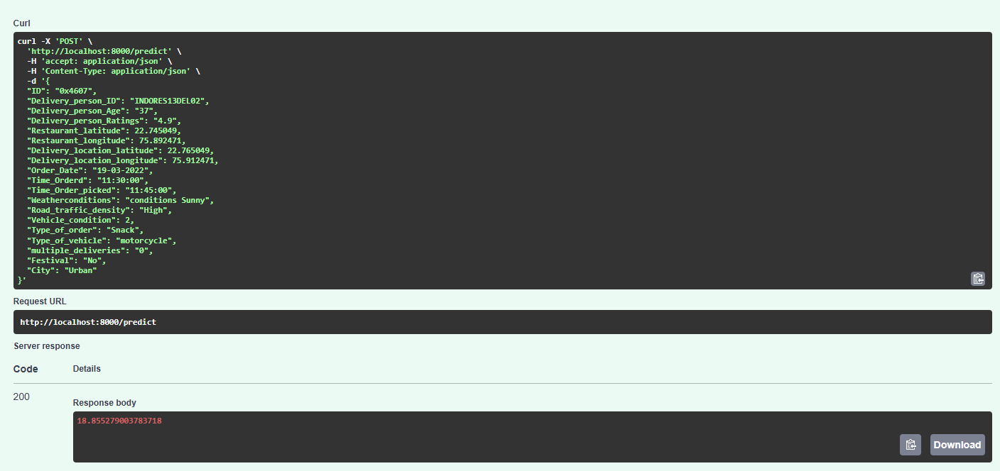

# 🚀 Swiggy Delivery Time Prediction – End-to-End MLOps Project

Predicting food delivery times using real-world Swiggy data through a fully automated, production-ready MLOps pipeline.

This project demonstrates a complete machine learning workflow, from data preprocessing and feature engineering to model training, evaluation, and cloud deployment. The system leverages modern MLOps practices, including DVC for data and pipeline versioning, MLflow for experiment tracking, Dagshub for remote artifact storage, and AWS + Docker for production deployment.

It is designed to be reproducible, scalable, and cloud-ready, making it an excellent showcase for industry-grade ML systems while being beginner-friendly for those learning MLOps.

**Tech Stack & Tools**:  

- **DVC** – Data & pipeline versioning  
- **MLflow** – Experiment tracking + Model registry  
- **Dagshub** – Remote artifact storage + MLflow backend  
- **AWS (S3, EC2, ECR)** – Cloud deployment  
- **FastAPI** – Model serving  
- **Docker** – Containerization  
- **CI/CD-ready architecture** – Reproducible & scalable  

This repository represents a **realistic industry-grade ML system** with reproducible pipelines and cloud-ready deployment.

---

## 📌 Project Overview

The model predicts **delivery time (minutes)** using:

- Restaurant & customer geo-coordinates  
- Order timestamp (hour, day, month)  
- Delivery partner attributes  
- Distance & time-based engineered features  

The final system is deployed as a **cloud-hosted API**.

---

## 📊 Dataset Overview

| Metric            | Value       |
|------------------|------------|
| Total Rows       | 41,000+    |
| Total Columns    | 20+        |
| Missing Values   | Yes        |
| Target Variable  | delivery_time |

---

## 🧹 Data Preprocessing & Feature Engineering

**Key Steps**:

- Column renaming & cleaning  
- Dropping irrelevant fields  
- Handling missing values:
  - `SimpleImputer`  
  - `KNNImputer`  
  - Missing indicator flags  
- Scaling:
  - `MinMaxScaler`, `StandardScaler`, `PowerTransformer`  
- Encoding:
  - One-Hot & Ordinal Encoding  
- Target transformation: **PowerTransformer → significant performance boost**

---

## 🏗️ Modeling

**Models Tested**:

- Linear Regression  
- RandomForestRegressor  
- XGBoost  
- Ridge / Lasso  
- Stacking Regressor (**final winner**)  

**✅ Best Model**:

- **Stacking Regressor**  
  - Base: XGBoost + RandomForest  
  - Meta: Linear Regression  
  - Target: PowerTransformer  

**🎯 Key Insights**:

- Stacking Regressor → best accuracy  
- PowerTransformer(target) consistently improves results  
- Missing-value indicators → no benefit for RandomForest  

---


## 📁 Repository Structure

```
├── data/
│ ├── raw/
│ ├── processed/
├── models/
├── notebooks/
├── src/
│ ├── data/
│ ├── features/
│ ├── models/
│ ├── utils/
│ └── app/
├── dvc.yaml
├── params.yaml
├── requirements.txt
└── README.md
```


---

## 📦 DVC Pipeline

Tracks & versions:

- Data cleaning  
- Preprocessing  
- Feature engineering  
- Model training & evaluation  

**Reproduce entire pipeline**:

dvc repro
<p align="left">
  
</p>

```bash

📈 MLflow + Dagshub Tracking

MLflow is fully integrated via Dagshub:
mlflow.set_tracking_uri("https://dagshub.com/<user>/<repo>.mlflow")
Tracks:

Metrics & Parameters

Models & Artifacts

Experiment comparison

## 🔥 Heatmap-Style Model Comparison

| Experiment | Model | Train MAE | Test MAE | Train R² | Test R² | CV MAE | Notes |
|-----------|--------|-----------|----------|----------|---------|--------|-------|
| Exp-1 | RandomForest | **1.15 🟢** | **3.08 🟠** | 0.97 | 0.82 | — | Overfitting |
| Exp-2 | XGBRegressor | 2.54 | 3.01 | 0.88 | 0.84 | 3.05 | Good balance |
| Exp-3 | XGB HPT | 2.82 | 2.97 | 0.86 | 0.84 | 3.01 | Lower overfitting |
| Exp-4 | RF HPT | 2.49 | 3.05 | 0.88 | 0.83 | 3.08 | Fallback model |
| Exp-5 | Stacking | — | **2.984 🔵** | — | — | — | LR meta-model |
| **Exp-6** | **Stacking (Final)** | **2.84 🟢** | **2.98 🟢** | **0.86** | **0.84** | **3.01** | Final winner |
```
<p align="left">
  
</p>

```
🐳 Docker Containerization

Build image:

docker build -t swiggy-model .


Run container:

docker run -p 8000:8000 swiggy-model

```
<p align="left">
  
</p>

```
⚡ FastAPI Endpoint

Start server:

uvicorn src.app.main:app --host 0.0.0.0 --port 8000


Example Request:

POST /predict
{
  "order_time": "13:20",
  "restaurant_latitude": 12.9718,
  "restaurant_longitude": 77.594,
  "delivery_latitude": 12.9355,
  "delivery_longitude": 77.6190
}
```
| FastAPI GET /get Example | FastAPI POST /predict |
|--------------------------|------------------------|
|  |  |


```
☁️ AWS Production Deployment
1️⃣ Push Docker Image to ECR
aws ecr create-repository --repository-name swiggy-api
aws ecr get-login-password --region ap-south-1 | docker login --username AWS --password-stdin <ECR-URI>

docker build -t swiggy-api .
docker tag swiggy-api:latest <ECR-URI>/swiggy-api:latest
docker push <ECR-URI>/swiggy-api:latest
```
```
2️⃣ Store Data & Models in S3
s3://swiggy-mlops-bucket/
├── data/
├── models/
├── artifacts/
└── mlflow/

3️⃣ Deploy API on EC2
sudo apt update
sudo apt install docker.io -y
docker pull <ECR-URI>/swiggy-api:latest
docker run -d -p 8000:8000 swiggy-api:latest


API Live At: http://<ec2-public-ip>:8000
```

```
┌───────────────────────────────┐
│ Developer (Git Push to GitHub)│
└───────────────┬───────────────┘
                ▼
┌──────────────────────────────────────────┐
│ GitHub Actions (CI/CD Pipeline)          │
│ • Build Docker image                     │
│ • Run tests                              │
│ • Push image to AWS ECR                  │
└───────────────┬──────────────────────────┘
                ▼
┌──────────────────────────────┐
│ AWS Elastic Container Registry│
│ (Stores your Docker images)  │
└───────────────┬──────────────┘
                ▼
┌──────────────────────────────────────────┐
│ AWS EC2 Instance                         │
│ • Pulls latest ECR image                 │
│ • Runs Docker container (FastAPI + model)│
│ • Exposes port 8000 publicly             │
└──────────────────────────────────────────┘
```


```
🧪 Testing Deployment
import requests

url = "http://<ec2-ip>:8000/predict"
payload = { ... }

response = requests.post(url, json=payload)
print(response.json())
```


🎯 Final Conclusions

Stacking Regressor (XGB + RF + LR) → Highest accuracy

PowerTransformer(target) → Major improvement

Missing-value indicators → No significant benefit

MLflow + DVC + Dagshub → Full reproducibility

AWS EC2 + ECR + S3 + Docker → Production-grade deployment

Architecture mirrors real industry ML systems.


⭐ How to Use

```bash
Clone repo:

git clone https://github.com/<user>/swiggy-delivery-time-prediction.git


Run pipeline:

dvc repro


Launch API:

uvicorn src.app.main:app --reload
```

⭐ Support & Feedback
<p align="center"> <a href="https://github.com/<user>/swiggy-delivery-time-prediction/stargazers"> /swiggy-delivery-time-prediction?style=social" alt="GitHub stars"/> </a> <a href="https://github.com/<user>/swiggy-delivery-time-prediction/fork"> /swiggy-delivery-time-prediction?style=social" alt="GitHub forks"/> </a> <a href="https://github.com/<user>/swiggy-delivery-time-prediction/issues"> /swiggy-delivery-time-prediction" alt="GitHub issues"/> </a> </p> <p align="center"> 🌟 *If you enjoyed this project, give it a star! Your support helps me build more production-ready MLOps projects.* 🌟 💡 *I’m learning, so suggestions, feedback, or ideas are highly appreciated!* 💡 </p>

